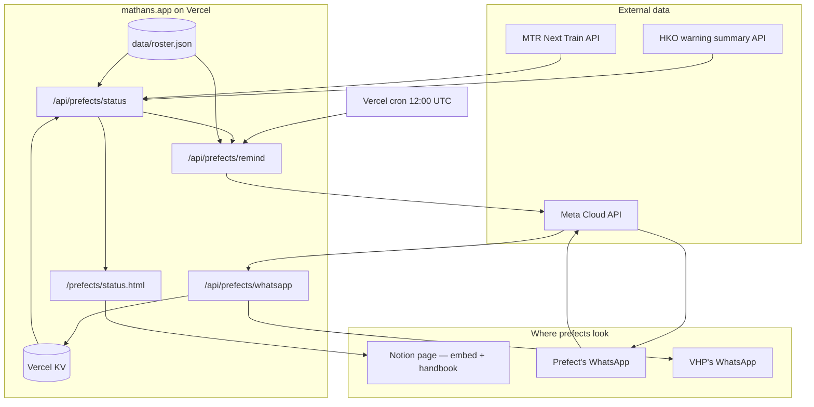

# Prefect Hub — project brief

## Background

St. Margaret's Co-educational English Secondary and Primary School runs a Prefect Board — the student disciplinary team responsible for gate duty, uniform inspection, lateness handling and morning assembly order. Around forty prefects, organised into rotating teams A, B and C.

Everything currently runs on paper and a WhatsApp group. Each month a PDF roster is printed and handed out. It contains the duty calendar, uniform inspection standards, four distinct lateness procedures, a daily checklist, and a yellow-highlighted SPECIAL REMARKS box that mixes permanent policy with one-off notices. Prefects find the right lateness procedure by reading all four.

This project is run entirely by students. There is no teacher-in-charge involved, no school IT support, and no budget. The person building it is the Vice-Head Prefect, who also maintains mathans.app.

**Scope boundary:** student violation records are explicitly **out of scope**. They stay on paper. Nothing in this system stores disciplinary data about any student. This matters — it is why the project needs no institutional data-governance sign-off.

---

## Aims

1. Prefects can check whether duty is running, moved indoors, or cancelled, without asking anyone
2. Prefects are reminded of their duty the evening before, with weather already factored in
3. Absences are reported privately and reach the VHP, not the whole group
4. The VHP is alerted when a duty slot falls below two prefects
5. The handbook is findable and structured, rather than a PDF nobody reopens

Non-aims: replacing the WhatsApp group, tracking student conduct, building an LMS.

---

## Architecture

Two independent halves. The **status endpoint** is read-only, has no Meta dependency, and can ship immediately. The **reminder system** depends on Meta template approval and prefect opt-in, both of which take a week or more of calendar time.

Build the status half first.

---

## Tools and services

| Layer | Choice | Notes |
|---|---|---|
| Hosting | Vercel, existing MathAns project | Hobby plan |
| Framework | Next.js — **verify App Router vs Pages Router before writing handlers** | changes handler signature |
| Scheduling | Vercel Cron | Hobby: once daily per job, fires anywhere within the scheduled hour, UTC only |
| State | Vercel KV | if the project has been migrated to Upstash Redis, swap the import; call shapes are identical |
| Roster | `data/roster.json` | plain file, edited by commit, no admin UI |
| Handbook | Notion, published to web | outside this repo |
| Messaging | Meta WhatsApp Cloud API, direct | no BSP, no business verification |

**Deliberately not used:** any BSP (Wati, Omnichat — subscription cost with no capability gain at this scale), Google Classroom (student accounts cannot create classes), SharePoint (login wall blocks link-sharing), a database for phone numbers beyond KV.

---

## Integrations

### HKO warning summary

`https://data.weather.gov.hk/weatherAPI/opendata/weather.php?dataType=warnsum&lang=en`

Codes: `WHOT`, `WCOLD`, `WTS`, `WRAIN` with subcodes `WRAINA`/`WRAINR`/`WRAINB`, `WTCSGNL` with `TC1`/`TC3`/`TC8NE`/`TC8SE`/`TC8NW`/`TC8SW`/`TC9`/`TC10`.

**Duty rules — these come from the school's official arrangements table. Do not alter them.**

| Signal | Result |
|---|---|
| Very Hot, Cold, Thunderstorm, Amber Rainstorm | Duty runs, assembly indoors; Thunderstorm and Amber add "bring an umbrella" |
| TC Signal No. 1 or No. 3 | Duty runs unchanged, heads-up only |
| Red or Black Rainstorm, TC Pre-No. 8 or above, in force after 05:30 | Duty suspended for the whole day |
| Strong Monsoon, Landslip, flooding announcements | No effect — do not surface as duty-affecting |

**Whole-day latch:** a suspending signal seen after 05:30 must be written to KV under `prefect:suspended:YYYY-MM-DD` and honoured for the rest of that day even after HKO stops reporting it. A signal lifted at 06:45 does not resume duty.

### MTR Next Train

`https://rt.data.gov.hk/v1/transport/mtr/getSchedule.php?line={LINE}&sta={STA}`

There is no public MTR disruption feed. Disruption is inferred: the response `status` field flips when special service arrangements are in place, and `isdelay` flags a delayed line. ETA is the fallback signal.

Lines serving the school: `TWL`/`SSP` (Sham Shui Po), `TML`/`NAC` and `TCL`/`NAC` (Nam Cheong). Per-line ETA thresholds because off-peak headways differ. ETA check only runs 06:30–08:30.

**MTR alerts are advisory.** They never suspend duty. Keep them visually subordinate to the weather card.

### Meta WhatsApp Cloud API

Unverified account, Tier 0 — 250 unique recipients per rolling 24 hours, up to 250 templates. Forty prefects at four sends a week is far inside this.

Seven approved templates: four for duty flow, three for notices (see `notice-templates.md`). All category **Utility**.

Business-initiated messages must be templates. Free-form text only works inside the 24-hour window a prefect opens by replying or tapping a button — which is why the "what's the reason?" follow-up is plain text and costs nothing.

**Every recipient must have opted in.** Store consent alongside the number.

### Verification required on first deploy

Field names below are taken from published specs, **not from live responses**. Set `DEBUG=1`, hit each endpoint once, log the raw payloads, and confirm before trusting them:

- warnsum: `code`, `actionCode`, and whether an issue timestamp is present
- Next Train: `status`, `isdelay`, `ttnt`, and the `{LINE}-{STA}` data key shape

Remove `DEBUG` before merging — it returns full upstream payloads on a public endpoint.

---

## UI

### Notion embed — `/prefects/status.html`

Three stacked cards, in this order top to bottom:

1. **Weather** — warning name, headline verdict, detail, footer reading "Suspensions are confirmed by WhatsApp — check the group before leaving home"
2. **MTR** — one line when normal, per-line detail when not
3. **Next duty** — date, time, place, team. No prefect names.

Colour tiers: green normal, amber advisory, red suspended. Next duty stays neutral grey until the duty is today or tomorrow, then turns accent — it must not compete with a weather warning for attention.

Dark mode via `prefers-color-scheme` is mandatory; Notion embeds inherit the reader's theme. Embed height around 260px, since Notion does not auto-size iframes and the suspension text is the longest state.

Failures must be **loud**. If an upstream call fails, show an amber "status unavailable" card telling the prefect to check the group and the HKO app. A blank card on a rainstorm morning is the worst outcome in this project.

### WhatsApp — prefect view

Evening-before template with two quick-reply buttons. Declining triggers a private free-form question; the reason relays to the VHP only, never the group.

### WhatsApp — VHP view

Absence relays, coverage alerts when a slot drops below two, and cover requests. Quiet by design — no message when the slot is covered.

**Suspension requires VHP approval.** When the weather logic determines duty should be cancelled, the system messages the VHP only, states that nothing has been sent, and waits for a `CANCEL` reply before notifying the board. An automated script must never tell forty prefects that school is off.

---

## Build order

1. Determine App Router vs Pages Router. Report before writing handlers.
2. Place the status endpoint, embed page and roster file. Verify upstream field names with `DEBUG=1`.
3. Attach KV, implement the whole-day suspension latch.
4. Ship the status embed to Notion. **This is a complete deliverable on its own.**
5. Meta setup: free the number, create the Business account, register for Cloud API, submit seven templates.
6. Collect prefect opt-in and numbers. Runs in parallel with steps 1–5 and takes the longest.
7. Build send handler, webhook, cron. Signature verification needs the **raw** request body.
8. Pilot with three prefects for one week before the full board.

---

## Constraints — do not change these without asking

- The weather-to-duty mapping. TC1 and TC3 do **not** suspend duty; Amber Rainstorm does **not** suspend duty. These look like bugs and are not.
- The two-prefect coverage minimum. One stays at the gate while the other escorts late students.
- Suspension asks the VHP first.
- Absence reasons go to the VHP privately, never to a group.
- No student conduct or violation data in any store.
- No `DEBUG` in committed code, no tokens in the repo.
- Templates stay in the Utility category. Congratulatory or social messages belong in the WhatsApp group.

## Open questions for the VHP

- Red or Black Rainstorm hoisted **before** 05:30 and still in force at 06:00 — the arrangements table starts at 05:30 and does not cover this
- Whether duty resumes if a No. 8 signal is lowered at 07:10
- Coverage minimum for duties other than the front gate

---

## Implementation notes — how this repo actually maps to the brief

Recorded as the build progressed; where reality differs from the plan above, this section wins.

- **Framework (build order step 1):** the repo is **not Next.js**. mathans.app is a static site with vanilla Vercel serverless functions under `/api` using the `(req, res)` Node signature — except the WhatsApp webhook, which uses the Web `Request`/`Response` signature because signature verification needs the raw request body.
- **State:** a generic Redis database via `REDIS_URL` and the `redis` package (`lib/prefect-redis-client.js`), not Vercel KV. Same call shapes, as anticipated.
- **Roster:** admin-edited in Redis via `/prefects/status/update` (key `prefect:roster`), not `data/roster.json`. Entries: `{ date, location, time, names }`.
- **Status half (steps 2–4):** shipped. `/api/prefects/status`, `/prefects/status.html` embed, simulator at `/prefects/status/test`, whole-day latch under `prefect:suspended:YYYY-MM-DD`. Upstream field names verified with a `DEBUG=1` env var (gated, not committed as code).
- **Webhook URL:** the Meta callback is **`https://www.mathans.app/whatsapp/prefects`** (rewritten to `/api/whatsapp/webhook`), not `/api/prefects/whatsapp` as drawn in the architecture diagram.
- **Crons:** two Vercel cron jobs (the Hobby-plan maximum) — `/api/whatsapp/remind` at 12:00 UTC (evening-before reminders, ~20:00 HK) and `/api/whatsapp/morning` at 22:00 UTC (morning suspension check, ~06:00 HK). Both fire anywhere within their hour, which the 05:30 cutoff tolerates.
- **Messaging code:** see `api/whatsapp/README.md` for endpoints, environment variables, template definitions and Redis keys.
- **Weather in reminders (VHP decision, Aug 2026):** the evening reminder is weather-free; a separate "today" weather template goes out with the morning cron (06:00–07:00 HK) when a warning is in force, since an evening forecast is stale by morning.
- **Per-reply notifications + web admin (VHP request, Aug 2026):** the "quiet by design" VHP inbox now pings once per prefect reply (with a running tally), and `/prefects/status/update` gained a WhatsApp section — live reply dashboard, notice sender, reminder resend, and the suspension CANCEL button (still a human VHP action, so the approval constraint stands).
- **Cover requests (VHP decision, Aug 2026):** the reserve-list COVER flow described under "WhatsApp — VHP view" was dropped — the VHP still gets the short alerts, and cover is arranged in the group chat.
